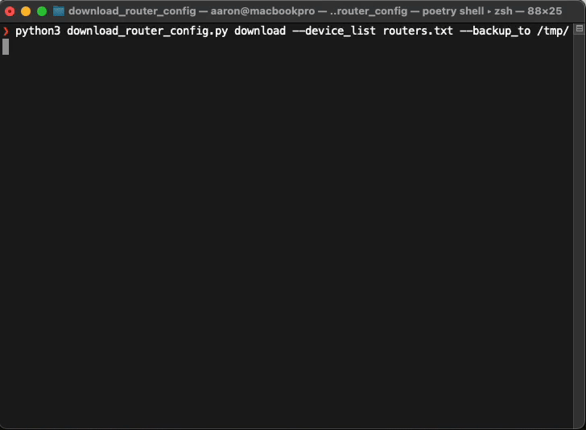

# Download Router Config

A Python script to capture the running-config of Cisco Routers and Switches.

## Getting Started

### About This Code
This script was originally written in Python2 and relied on [Exscript](https://github.com/knipknap/exscript/) to handle the 'heavy lifting' of communicating with the router.

However, in conjunction with updating this code to work with Python3, I've selected [NAPALM](https://github.com/napalm-automation/napalm) to replace the functionality that Exscript once provided.

#### Requirements
1. This application is hard-coded to use the SSH2 protocol; If SSH v2 is not enabled on your router(s), you will need to add `ip ssh version 2` to your Cisco router(s) configuration and any associated access-list changes.
2. A valid username/password.
3. A text file containing hostnames or IP Addresses of your routers/switches, one entry per line.

#### Assumptions
1. This application was written for use on Cisco IOS devices and cannot be guaranteed to work on other makes/model routers.
2. This application assumes that you have enable privileges on each router in order to execute the `show running-config` command.  If you do not have sufficient user privileges, this application will not work as designed.

#### Limitations
1. This application uses the same username/password to access ALL routers. If your routers use unique usernames/passwords, then this script will not work. (Yes this is a terrible idea but let's not pretend it's not like this at many companies.)

#### Python Libraries
* See [pyproject.toml](pyproject.toml)

### Instructions For Use

* Clone this repository, create virtual environment and install packages.
  * `git clone https://github.com/aaronmelton/DownloadRouterConfig.git`
  * `cd DownloadRouterConfig`
  * `poetry shell`
  * `poetry update`
* Follow instructions for Python or Docker (below).

#### Python Commands

`python download_router_config.py --help`  for help.

Use `--device_list <filename>` to specify input file.
   
Use `--backup_to <path>` to specify where to save config files.

For example, `python3 download_router_config.py download --device_list switches.txt --backup_to /tmp/` to download the configuration file of all devices mentioned in `switches.txt` into the `/tmp/` directory.

#### Docker Commands

* To pull/build the Docker image:
`docker build -t download_router_config .`

* To run the script:
`docker run -v /local_directory:/container_directory -it -e LOG_LEVEL=DEBUG -e LOG_PATH=/tmp/ --rm download_router_config:latest download --device_list /container_directory/switches.txt --backup_to /container_directory/`

Replace the values for LOG_LEVEL, LOG_PATH and CLI arguments (device_list, backup_to) to suit your needs.

## Authors
* **Aaron Melton** - *Author* - Aaron Melton <aaron@aaronmelton.com>
